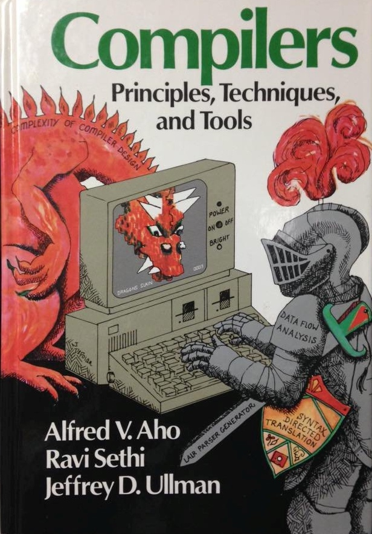

# complexity

When authoring a large system
our first concern, always,
is to control Complexity.

[Aho et al.](https://en.wikipedia.org/wiki/Compilers:_Principles,_Techniques,_and_Tools)
had it exactly right:

{height=300px}

We do battle with the dragon of complexity every day.

If you see a system starting to get away from you,
starting to get too complex,
don't let it.
Find a way to reorganize or refactor,
so the top-level code is short,
using nouns & verbs from the problem domain.

Pay attention to coupling.
The nice thing about a short function that does _one_ thing well
is it won't need dozens of variables interacting with one another.
Upon exiting, its local variables disappear in a puff of smoke.

Eliminate [repeated boilerplate](https://en.wikipedia.org/wiki/Don%27t_repeat_yourself).
Identify the concept your copy-pasta code is addressing,
pick a good name for it,
then re-factor it out.

If you let code become too complex
or data flow become too obscure,
you'll be faced with a system that no one properly understands.
And then all the "-ilities", like maintainability, go out the window.
