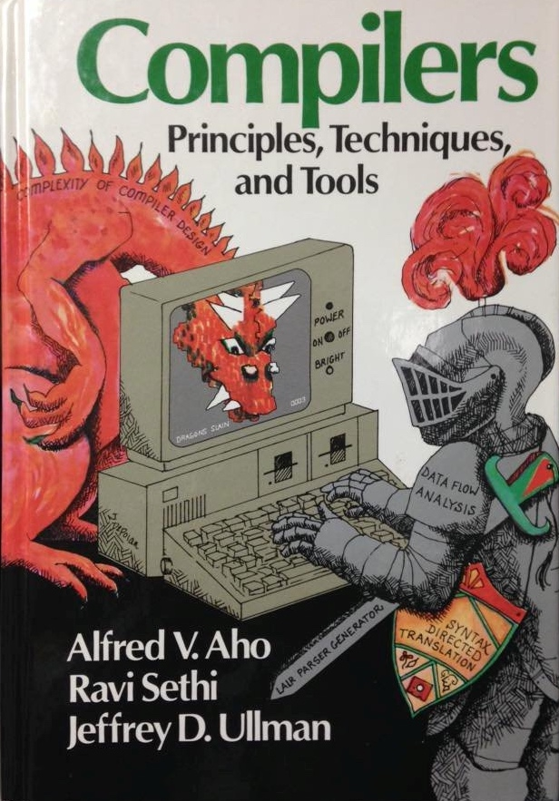

# complexity

When authoring a large system
our first concern, always,
is to control Complexity.

Aho et al. had it exactly right:

{height=3cm}

We do battle with the dragon of complexity every day.
