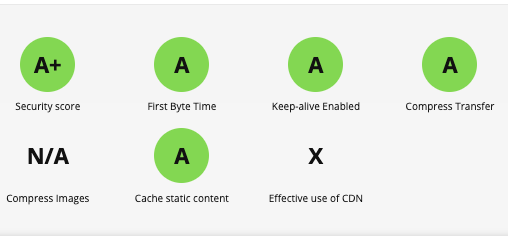

# nginx config checklist

Nginx is a great webserver.
Out of the box, on ubuntu focal fosaa, it is very solid.

[WebPageTest.org](https://www.webpagetest.org)
is a very nice service to assess content delivery.
It helps answer the question, why is this page slow?,
why does it take so long to load?

The stock nginx config needs a few tweaks to
score A's on that test. Here's what I found I had to add
to the "http" section of nginx.conf in /etc/nginx:

    charset utf-8;
    add_header Cache-Control "max-age=604800, public";
    add_header Content-Security-Policy "default-src 'self'; img-src https://*; child-src 'none';" always;
    add_header Strict-Transport-Security "max-age=3600" always;
    add_header X-Content-Type-Options "nosniff" always;
    add_header X-Frame-Options: "DENY";
    add_header X-XSS-Protection "1; mode=block" always;
    gzip_types text/plain text/css application/json application/javascript text/xml image/x-icon;

YMMV.
I _was_ a little surprised to initially see documents delivered without
explicit character set, which regrettably led to browsers defaulting to Latin-1.
